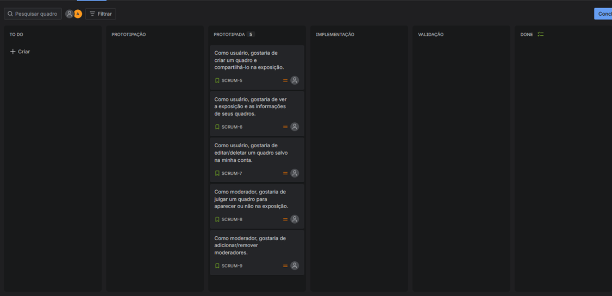
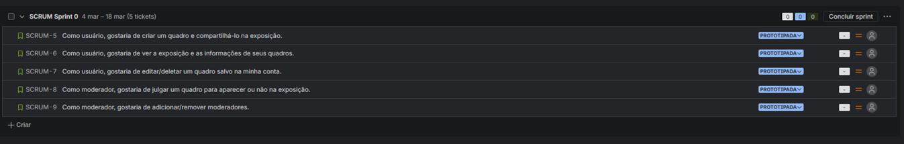

# Pixtar Creator

**Site de criação e compartilhamento de imagens baseado no editor de personagem do jogo Cosmopax.**

O site disponibilizará um editor que permite a criação de imagens utilizando apenas caracteres do teclado, com opção de movê-los pela tela, aumentar/diminuir, rotacionar, distorcer, entre outros.

Uma recriação do editor do jogo online brasileiro de 2005 Cosmopax, que por vez se inspirou na arte ASCII. Ele era usado para criar os personagens, Pixtars, do jogo, mas *Pixtar Creator* será mais voltado para a criação geral de imagens, sem área de cabeça/corpo/braços/pernas e com algumas funcionalidades a mais.

Os usuários poderão fazer o download das suas imagens, guardá-las em suas contas e compartilhá-las num quadro público.

## Desenvolvimento

O editor será implementado em JavaScript, e as funcionalidades do site em Python usando a ferramenta Django.

**Equipe:** Ana Beatriz da Costa Saraiva

### Entrega 1

[Doc das histórias do usuário](https://docs.google.com/document/d/1s5gnLZ-HJxI0zj9DhQtqWh3xZQX32v1r89KSsGNX6iQ/edit?usp=sharing) |
[Figma das histórias do usuário](https://www.figma.com/design/25ntFFuMZaWwq70nahypD4/Sem-t%C3%ADtulo?node-id=0-1&t=3tm4WbWRHp43bi8a-1)

[Vídeo história 1](https://www.youtube.com/watch?v=MWfAW5oXsy8) |
[Vídeo história 2](https://www.youtube.com/watch?v=Kcgki2Zz02g) |
[Vídeo história 3](https://www.youtube.com/watch?v=KwXrGhXPJ0k) |
[Vídeo história 4](https://www.youtube.com/watch?v=_v5g7-W5bSM) |
[Vídeo história 5](https://www.youtube.com/watch?v=eQiCEe5q1II) |

